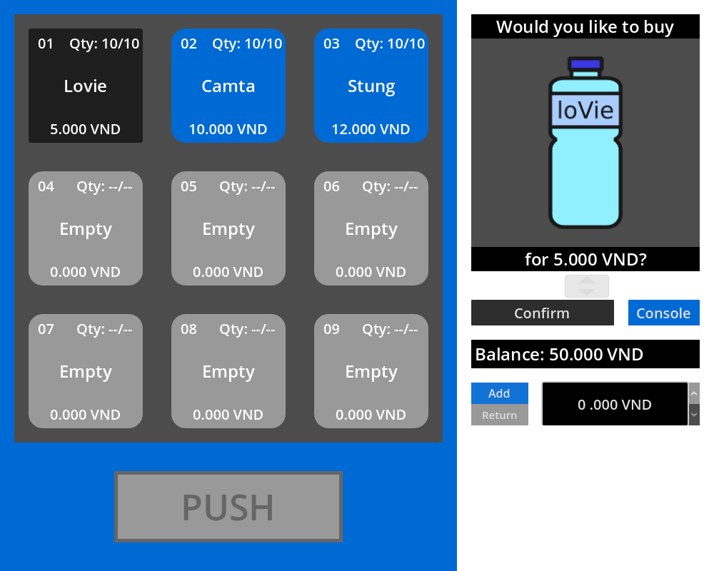

# Vending Machine Simulator
Submission for **Project I - IT3910E**, Hanoi University of Science and Technology
By **Tạ Hồ Thành Đạt 20225482**

## Description
This project is a simple implementation of a vending machine system using Godot game engine for both front-end and back-end implementations.
The main goal of the project is to design and demonstrate some basic functionalities of an everyday vending machine such as buying and  restocking products.
The project also includes the ability to query on transactional data generated from purchasing products and exporting them as csv files.

## Functionalities
- Add balance and purchase items
- Restocks, changes displayed items
- Imports, exports and queries on transaction data

## Installation
Extract and run the latest release [here](https://github.com/DatTaho/Project-I/releases/tag/ver1-1-0).